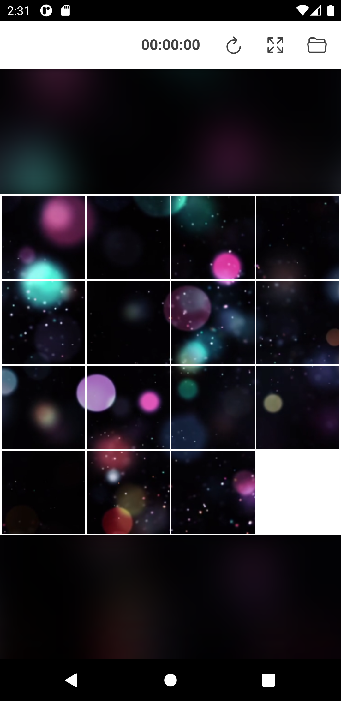
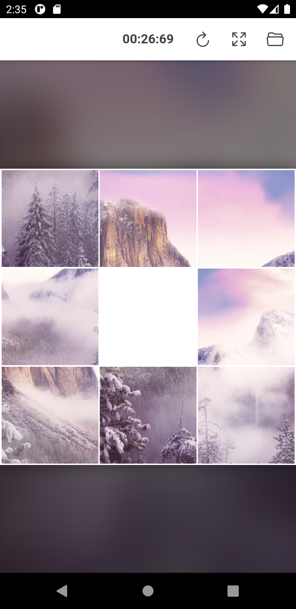
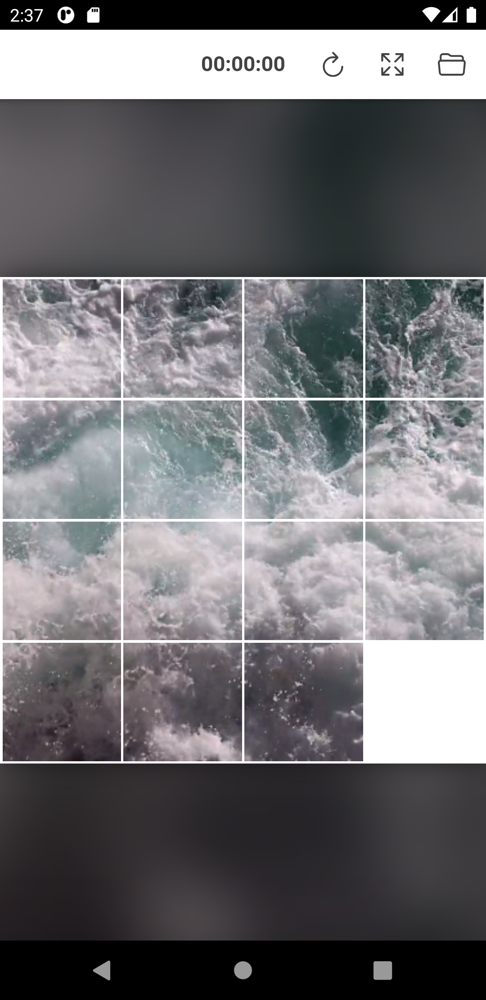

# VideoSlidePuzzle
- create your own sliding puzzle from any video or image for play its sliding puzzle
- Currently, I fail to implement on android. This is too heavy to load(too laggy). 
- vue ionic is used to implement for web and android
- play on [web](https://slidepuzzle.web.app/)


# Result   
    
     
     


# Features
- user can create own sliding puzzle from user given video or image 
- video tile is supported to visualise during play sliding puzzle
- provide sample video for creating sliding puzzle
- timer is placed to record solve time of sliding puzzle
- tablet screen size is supported to enlarge sliding puzzle
- support simultaneous movement on same row tiles 

# How to play
- touch image tile to move sliding puzzle tile to empty space
- sliding puzzle game is solved when all splitted tile is in ordered position

  
# Required environment to run    
```python
npm install -g @ionic/cli@latest native-run cordova-res    
npm install -g firebase-tools
#ionic start VideoSlidePuzzle blank --type vue
#cd VideoSlidePuzzle
#ionic integrations enable capacitor
#ionic build
#ionic cap add android

#vue add pwa
#firebase login
#firebase init
#ionic build
#firebase deploy

npm i python-range --save
npm i shuffle-array --save
```

# Run serve
```python
ionic serve
```

# Run build   
```python
ionic build
firebase deploy
```
  
# Acknowledgement and References  
- [Vue.js](https://vuejs.org/)
- [ionic](https://ionicframework.com/)
- [vue-8-puzzle](https://github.com/meganetaaan/vue-8-puzzle)
- [Vue Slide Puzzle](https://codepen.io/oldcoyote/pen/OwJvxV)
- [Slide Puzzle](https://codepen.io/mkeke/pen/ByzXeJ) 


